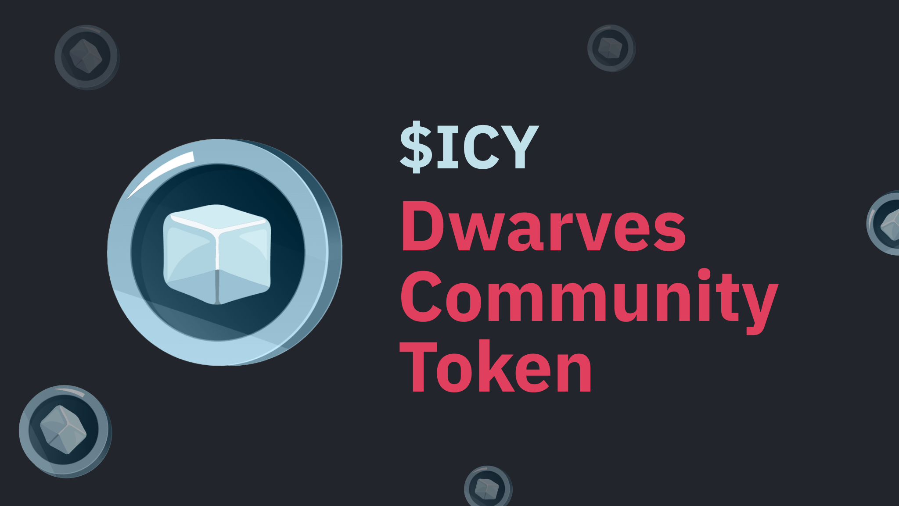

## :information_source: Information

- [Website](https://icy.d.foundation)
- Base network
- 1 $ICY = **1.5** $USDC
- You can earn $ICY by:
  - Contribute to brainery
  - Sharing & discuss
  - Do many more things at [earn.d.foundation](https://earn.d.foundation)

## :camera: Screenshots


## :running: Run the project (for devs)

First, run the development server:

```bash
npm run dev
# or
yarn dev
```

Open [http://localhost:3000](http://localhost:3000) with your browser to see the result.

## Environment Variables

| Name                                       | Value | Note                                                                                     |
| ------------------------------------------ | ----- | ---------------------------------------------------------------------------------------- |
| `NEXT_PUBLIC_ICY_CONTRACT_ADDRESS`         |       |                                                                                          |
| `NEXT_PUBLIC_USDC_CONTRACT_ADDRESS`        |       |                                                                                          |
| `NEXT_PUBLIC_ICY_SWAPPER_CONTRACT_ADDRESS` |       |                                                                                          |
| `NEXT_PUBLIC_RATE`                         |       | This is just for showing on UI, changing this does not change the actual swapping amount |
| `WEBHOOK_ID`                               |       | Discord webhook                                                                          |
| `WEBHOOK_TOKEN`                            |       | Discord webhook                                                                          |

## :pray: Credits

A big thank to all who contributed to this project!

[](https://github.com/dwarvesf/icy-swap/graphs/contributors)
